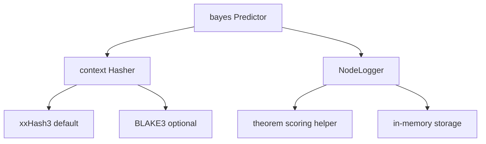

# Contributing

Thanks for contributing to `go-bayes`.

## Prerequisites

- Go 1.22 or newer
- `golangci-lint`
- `markdownlint-cli2`

## Local Commands

Run the complete local validation gate:

```sh
make check
```

Run individual checks:

```sh
make test
make test_example
make coverage
make bench
make fuzz
```

The library packages have 100% statement coverage. `make coverage` uses a 99.9% minimum. Directories beginning with `_` are excluded from Go's default `./...` expansion, so `make test_example` finds and tests each runnable example explicitly.

## Package Structure

- `bayes`: Public constructor, predictor, persistence, and hasher selection API.
- `bayes/hasher`: Public transition-hasher interface.
- `bayes/nodelogger`: Public transition-statistics interface.
- `bayes/internal/hashers/xxHash3base`: Default xxHash3 context hasher.
- `bayes/internal/hashers/blake3base`: Optional BLAKE3 context hasher.
- `bayes/internal/nodeloggers/logmem`: In-memory transition statistics.
- `bayes/internal/theorem`: Current Bayes-based scoring helper.



Read the [technical specification](../SPEC.md) before changing context folding, training expansion, scoring, or class recovery.

## Reporting Bugs

Open an issue when you find a bug. When possible, include a small test or program that reproduces it. Reproduction code helps us confirm the problem and respond faster.

## Branch and Pull Request Conventions

Use short branch names prefixed by intent: `fix/...`, `feat/...`, `docs/...`, or `refactor/...`.

- Follow the "fix one thing" rule. Keep each PR focused on one topic.
- Open an issue before starting a large PR so that we can discuss its scope.
- Include test evidence in the PR description.

## Style Expectations

- Keep comments simple and clear in English.
- Prefer small functions and explicit error handling.
- Follow existing naming and package boundaries.
