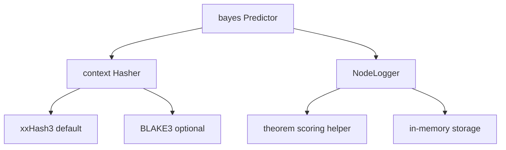

<!-- markdownlint-disable MD041 -->
[](https://github.com/KEINOS/go-bayes/blob/main/go.mod)
[](https://pkg.go.dev/github.com/KEINOS/go-bayes/bayes)

# go-bayes

`github.com/KEINOS/go-bayes/bayes` is a Bayesian inference package for Go. Its current predictor is a Folded Context Transition Predictor (FCTP).

The package learns transitions from an ordered context to a possible next value. It converts supported values to fixed-width item IDs, folds a variable-length context into one fixed-width context ID, scores the learned candidate transitions, and returns the most likely class ID. Use `GetClass` to resolve that ID to the original value recorded during training.

The predictor uses learned probabilities to estimate the most likely next value for an observed context. Its scoring calculation is based on Bayes' theorem. It is not a Naive Bayes classifier. It learns transitions from an ordered context to the value that follows it.

See the [technical specification](SPEC.md) for the two-ID learning model, context folding, training expansion, and current design limits.

> [!IMPORTANT]
> The latest published release is `v0.0.3`. Until `v1.0.0`, a clear API, ease of use, and measured performance are more important than backward compatibility. The API can change before the first stable release.

## How It Learns

Training an ordered sequence `A -> B -> C -> D` records direct transitions and folded suffix contexts for each observed next value. The knowledge relevant to `D` includes:

```text
C             -> D
FOLD(C)       -> D
FOLD(B, C)    -> D
FOLD(A, B, C) -> D
```

Calling `Predict([]T{A, B, C})` computes `FOLD(A, B, C)`, compares the learned candidate class IDs, and returns the highest-scoring ID. Training also records contexts that predict `B` and `C`; every item after the first item in a training sequence is a possible class.

The current predictor matches deterministic folded IDs. It does not calculate similarity between values and does not automatically retry shorter contexts when a full context is unknown. A caller can implement backoff by retrying shorter suffixes.

## Quick Start

Install the module:

```sh
go get github.com/KEINOS/go-bayes@latest
```

Train a sequence and predict its next value:

```go
package main

import (
 "fmt"
 "log"

 "github.com/KEINOS/go-bayes/bayes"
)

func main() {
 predictor, err := bayes.New(bayes.MemoryStorage, 100)
 if err != nil {
  log.Fatal(err)
 }

 melody := []string{
  "So", "So", "La", "So", "Do", "Si",
  "So", "So", "La", "So", "Re", "Do",
 }

 err = predictor.Train(melody)
 if err != nil {
  log.Fatal(err)
 }

 classID, err := predictor.Predict([]string{"So", "So", "La", "So", "Do", "Si"})
 if err != nil {
  log.Fatal(err)
 }

 fmt.Println(predictor.GetClass(classID))
 // Output: So
}
```

`New` creates an isolated predictor backed by in-memory storage and uses xxHash3 for context folding by default. A `Predictor` is not safe for concurrent use; callers must synchronize shared access.

## Value and ID Semantics

`Train`, `Predict`, and `HashTrans` accept slices or values composed of these built-in types:

- `bool` and `string`;
- `int`, `int16`, `int32`, and `int64`;
- `uint`, `uint16`, `uint32`, and `uint64`;
- `float32` and `float64`.

Integer values preserve their bit pattern. Strings receive deterministic fixed-width IDs. Floating-point values are currently converted with `uint64(value)`, so fractional parts are discarded; use scaled integers or canonical strings when fractions are significant.

IDs are deterministic identifiers, not collision-free or reversible encodings. `GetClass` depends on the predictor's class map and returns `nil` for an unknown class ID.

## Hashers

xxHash3 is the default context-folding algorithm. Select BLAKE3 when compatibility with BLAKE3-derived context IDs is required:

```go
predictor, err := bayes.New(
 bayes.MemoryStorage,
 42,
 bayes.WithHasher("blake3"),
)
```

Use `NewPredictor` to inject a custom implementation of `bayes.Hasher`:

```go
predictor, err := bayes.NewPredictor(bayes.PredictorConfig{
 Storage: bayes.MemoryStorage,
 ScopeID: 42,
 Hasher:  customHasher,
})
```

Changing the hasher changes context IDs. Use the same algorithm for training and prediction.

The selected hasher folds a context into one context ID. String values use their own fixed BLAKE3-based item IDs before the context is folded.

## Persistence

`Predictor` implements `encoding/json` marshaling and unmarshaling for `MemoryStorage`:

```go
payload, err := json.Marshal(predictor)
if err != nil {
 log.Fatal(err)
}

var restored bayes.Predictor

err = json.Unmarshal(payload, &restored)
if err != nil {
 log.Fatal(err)
}
```

The JSON format stores transition state, scope, storage type, and the class map. JSON does not preserve the exact Go type of numeric class values. For example, an `int` class value is restored as `float64`.

The format does not store the selected hasher. Unmarshaling selects the default xxHash3 hasher. After restoring data trained with BLAKE3 or a custom hasher, call `SetHasher` with the matching implementation before prediction.

`Reset` clears learned transitions and classes. `SetStorage` selects the backend used by the next `Reset`; only `MemoryStorage` is currently implemented.

## Runnable Example

The [Iris example](_examples/iris/README.md) trains all 150 records from the original UCI CSV data and demonstrates the complete constructor, training, prediction, and class-resolution flow. The [Wine example](_examples/wine/README.md) repeats the flow with 13 ordered chemical measurements and three classes.

```sh
go run ./_examples/iris
go run ./_examples/wine
```

See the [examples overview](_examples/README.md) for validation commands and additional examples.

## Package Structure

- `bayes`: Public constructor, predictor, persistence, and hasher selection API.
- `bayes/hasher`: Public transition-hasher interface.
- `bayes/nodelogger`: Public transition-statistics interface.
- `bayes/internal/hashers/xxHash3base`: Default xxHash3 context hasher.
- `bayes/internal/hashers/blake3base`: Optional BLAKE3 context hasher.
- `bayes/internal/nodeloggers/logmem`: In-memory transition statistics.
- `bayes/internal/theorem`: Current Bayes-based scoring helper.



## Development

Run the complete local validation gate:

```sh
make check
```

Run individual checks:

```sh
make test
make test_example
make coverage
make bench
make fuzz
```

The library packages have 100% statement coverage. `make coverage` uses a 99.9% minimum. Directories beginning with `_` are excluded from Go's default `./...` expansion, so `make test_example` finds and tests each runnable example explicitly.

## Roadmap

- Add a pruning policy for low-value transitions.
- Add persistent storage backends such as SQLite.
- Evaluate explicit suffix backoff strategies.
- Explore optional order-invariant and neural-style modes without changing the default FCTP contract.
- Add more runnable, real-data examples.

## Contributing

[](https://github.com/KEINOS/go-bayes/actions/workflows/unit-test.yml)
[](https://github.com/KEINOS/go-bayes/actions/workflows/golangci-lint.yml "Static analysis")
[](https://codecov.io/gh/KEINOS/go-bayes "Code coverage")
[](https://github.com/KEINOS/go-bayes/actions/workflows/codeql-analysis.yml)
[](https://goreportcard.com/report/github.com/KEINOS/go-bayes "View report card")

Changes should include appropriate tests or runnable examples and pass `make check`. Open pull requests against `main`; a draft pull request is welcome while work is in progress.
