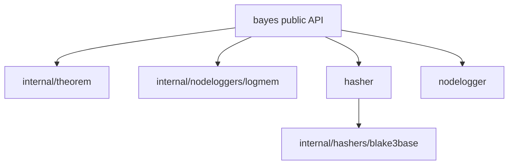

<!-- markdownlint-disable MD041 -->
[](https://github.com/KEINOS/go-bayes/blob/main/go.mod)
[](https://pkg.go.dev/github.com/KEINOS/go-bayes/bayes)

# go-bayes

`github.com/KEINOS/go-bayes/bayes` is a Go package for Bayesian inference.

## Highlights

- Constructor-based API with explicit dependencies via `New` and `NewPredictor`.
- Deterministic transition hashing using BLAKE3-based default hasher.
- JSON serialization/deserialization support for predictor state.
- In-memory storage backend optimized for deterministic tests and examples.

## Usage

```sh
# Download the module
go get github.com/KEINOS/go-bayes/bayes
```

```go
// Import the package
import "github.com/KEINOS/go-bayes/bayes"
```

### Constructor-Based API (Recommended)

The `New` instance-based API is the recommended approach for new code and
provides better isolation, testability, and control over dependencies.

```go
package main

import (
    "fmt"
    "log"

    "github.com/KEINOS/go-bayes/bayes"
)

func main() {
    // Create a new predictor instance
    predictor, err := bayes.New(bayes.MemoryStorage, 0)
    if err != nil {
        log.Fatal(err)
    }

    // Train the predictor
    score := []string{
        "So", "So", "La", "So", "Do", "Si",
        "So", "So", "La", "So", "Re", "Do",
        "So", "So", "So", "Mi", "Do", "Si", "La",
        "Fa", "Fa", "Mi", "Do", "Re", "Do",
    }
    if err := predictor.Train(score); err != nil {
        log.Fatal(err)
    }

    // Predict next item
    nextID, err := predictor.Predict([]string{"So", "So", "La", "So", "Do", "Si"})
    if err != nil {
        log.Fatal(err)
    }

    // Get the original value
    nextNote := predictor.GetClass(nextID)
    fmt.Printf("Next note: %v\n", nextNote)
    // Output: Next note: So
}
```

- [View it online](https://go.dev/play/p/N2-0xNxAKp9) @ GoPlayground

### Persist and Restore Predictor State (JSON)

`Predictor` supports `encoding/json` marshaling and unmarshaling.

```go
payload, err := json.Marshal(predictor)
if err != nil {
    log.Fatal(err)
}

var restored bayes.Predictor
if err := json.Unmarshal(payload, &restored); err != nil {
    log.Fatal(err)
}
```

Use this when you want to save a trained model snapshot and restore it later.

## Examples

- [Examples overview](_examples/README.md)
- [Training with a slice of boolean values](
  https://pkg.go.dev/github.com/KEINOS/go-bayes/bayes#example-Train-Bool)
- [Training with a slice of int values](
  https://pkg.go.dev/github.com/KEINOS/go-bayes/bayes#example-Train-Int)
- [Iris dataset example](_examples/iris/README.md)

## Package Structure

- `bayes`: Public API and predictor implementation.
- `bayes/internal/theorem`: Core Bayes theorem computation.
- `bayes/internal/nodeloggers/logmem`: In-memory transition counter and probability source.
- `bayes/hasher`: Transition hasher interface.
- `bayes/internal/hashers/blake3base`: Default hash implementation for flow IDs.
- `bayes/nodelogger`: Public node logger interface used by `Predictor`.



## Development

Run tests:

```sh
go test ./...
```

Run coverage:

```sh
go test -cover ./...
```

Run static checks:

```sh
go vet ./...
golangci-lint run --fix
```

## Glossary

- Prior probability: The base chance of an event before observing new context.
- Node: A unit item in the sequence (for example a note or token).
- Flow ID: A deterministic hash generated from transitions.
- Transition: The move from one node to the next.
- Class: The original value stored behind an internal numeric ID.

## Advanced Configuration

Use `NewPredictor` when you need to inject a custom hasher or build a
predictor from an explicit config object.

```go
predictor, err := bayes.NewPredictor(bayes.PredictorConfig{
    Storage: bayes.MemoryStorage,
    ScopeID: 42,
    Hasher:  customHasher,
})
```

## Contribute

[](https://github.com/KEINOS/go-bayes/actions/workflows/unit-test.yml)
[](https://github.com/KEINOS/go-bayes/actions/workflows/golangci-lint.yml "Static Analysis")
[](https://codecov.io/gh/KEINOS/go-bayes "Code Coverage")
[](https://github.com/KEINOS/go-bayes/actions/workflows/codeql-analysis.yml)
[](https://goreportcard.com/report/github.com/KEINOS/go-bayes "View Report Card")

- Any PullRequest for improvement are welcome!
- Branch to PR: `main`
  - [Draft PR](https://github.blog/2019-02-14-introducing-draft-pull-requests/)
        before full implementation is recommended.
- We will merge any PR for the better, as long as it passes the
    [CI](https://github.com/KEINOS/go-bayes/actions)s and not a
    prank-kind commit. ;-)

## v2 Release (Current)

This is v2 of go-bayes with the following breaking changes from v1:

- **Removed** all package-level legacy API functions (`Train`, `Predict`, `GetClass`, `SetStorage`, `SetHasher`, `Reset`).
- **Removed** compatibility alias `UnknwonStorage`; use `UnknownStorage` only.
- **Removed** global state and singleton pattern; all operations are instance-based via `Predictor`.

If you are upgrading from v1, see the [Usage](#usage) section for the
constructor-based API pattern.

## Wishlist/Todo

- [x] ~~100% code coverage for the current implementation~~
- [x] ~~fix all golangci-lint issues for the current implementation~~
- [x] ~~vulnerability scanning with CodeQL~~
- [x] ~~feat CIs with GitHub Actions~~
- [x] ~~feat benchmarking~~ (implemented in Phase 4)
- [x] ~~feat dumping the trained model to a file~~ (JSON serialization in Phase 8-2)
- [ ] testdata with big sized data
- [ ] SQLite3 as a storage backend
    (implementation of [NodeLogger](https://pkg.go.dev/github.com/KEINOS/go-bayes/bayes#NodeLogger) with SQLite3)
- [ ] more examples of use cases
- [ ] simple command tool to train and predict
