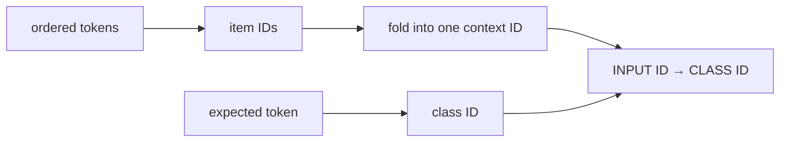

# Technical Specification

## Purpose

`go-bayes` is a Bayesian inference package for ordered data. Its current model is a Folded Context Transition Predictor (FCTP).

The main idea is small: every learned fact becomes a pair of two fixed-width IDs.

```text
INPUT ID -> CLASS ID
```

`INPUT ID` can represent one token or an ordered context of many tokens. `CLASS ID` represents a possible next value. The storage layer therefore does not need a different data structure for a longer context.

In this document, “two-ID pair” means two values in one record. It does not mean binary data with only `0` and `1`.

## Core Data Path

The predictor converts input data in three steps:



1. Convert each supported token to a `uint64` item ID.
2. Fold one or more ordered item IDs into one `uint64` context ID.
3. Store the context ID and expected class ID as one two-ID pair.

This conversion removes the original context length from the storage boundary. A one-token input and a one-thousand-token input can both be represented by one `uint64` input ID.

## Value IDs

The current implementation accepts booleans, strings, selected integer types, and floating-point numbers. It converts each value to canonical bytes in this order:

```text
item domain byte (0x01) | Go type tag | value payload
```

Every supported Go type has a different tag. The payload for an `int` is widened to `int64`, and the payload for a `uint` is widened to `uint64`. Integer payloads use big-endian byte order. Floating-point payloads use their IEEE bit representation, so fractions and NaN bit patterns are preserved.

The predictor passes these bytes to its selected hasher. This means `true`, `int(1)`, `uint64(1)`, and `float64(1)` have different IDs. The tags remove representation ambiguity, but they do not prevent hash collisions.

## Context Folding

The predictor encodes the ordered item IDs as canonical context bytes:

```text
context domain byte (0x02) | item count as uvarint | big-endian item IDs
```

It passes these bytes to the same hasher that creates value IDs. xxHash3 is the default. BLAKE3 and custom implementations of the public `Hasher` interface are also supported.

The order is part of the input. `FOLD(A, B, C)` and `FOLD(C, A, B)` are different contexts in normal use.

The result is deterministic for the same input and hasher. It is not unique in the mathematical sense. Any fixed-width hash can have collisions.

## Learning

`Train` reads an ordered sequence from left to right. Each value after the first value becomes a possible class.

For this sequence:

```text
A -> B -> C -> D
```

the predictor records the folded suffix contexts. The records for class `D` are:

```text
FOLD(C)        -> ID(D)
FOLD(B, C)     -> ID(D)
FOLD(A, B, C)  -> ID(D)
```

It also creates records that predict `B` and `C`. Every record still has only two values: one input ID and one class ID.

This suffix expansion lets the same class collect evidence from contexts of different lengths. It also causes the number of stored records to grow as training sequences become longer. A future pruning feature can remove low-value records.

## Prediction

`Predict` converts all supplied tokens to item IDs and folds the complete ordered input into one context ID.

For input `A, B, C`, it uses:

```text
FOLD(A, B, C) -> INPUT ID
```

The predictor scores that input ID against every known class ID. It returns the class ID with the highest positive score. `GetClass` maps the returned ID to the original value saved during training.

The current predictor uses exact context IDs. It does not measure similarity between token values. It also does not retry shorter contexts when the complete context has no useful match. A caller can add this backoff by calling `Predict` again with shorter suffixes.

If no class has a positive score, `Predict` returns `0`. Because `0` can also be a valid class ID, callers cannot use the returned ID alone to distinguish these cases. If multiple classes have the same highest score, any one of them can be returned.

## Bayesian Scoring

The in-memory logger counts observed `INPUT ID -> CLASS ID` pairs. During prediction, it derives frequencies from those counts and sends them to the current Bayes-based scoring helper. The predictor compares the returned scores; it does not expose a complex probability model to the storage interface.

This makes Bayesian scoring one part of the implementation. FCTP describes how the input context becomes an ID and how that ID connects to a class. The model is not Naive Bayes and does not split the input into independent features.

The probability input contract is under review before `v1.0.0`. Some current inputs are frequencies over all stored observations, rather than conditional probabilities. Any correction must define the intended behavior and add tests before it changes prediction results.

## Class Recovery

A hash is not reversible. The predictor therefore keeps a class map:

```text
CLASS ID -> original Go value
```

`GetClass` reads this map. It returns `nil` for an unknown ID.

JSON persistence stores schema version 1, the hasher name, the class map, and transition state. JSON restores numeric class values as `float64`. Built-in hashers are restored by name. A custom snapshot can be restored only into a predictor that already has a custom hasher with the same name. Missing and unknown schema versions are rejected.

## Design Boundary

The stable idea of FCTP is the two-ID learning boundary:

```text
arbitrary ordered context -> fixed-width INPUT ID
possible next value       -> fixed-width CLASS ID
learned fact               -> INPUT ID, CLASS ID
```

Hash algorithms, canonical encoding versions, probability scoring, storage, pruning, and backoff can change without removing this idea. An implementation that no longer folds an ordered context into one input ID uses a different model.

The project is still before `v1.0.0`. API clarity, ease of use, and measured performance are more important than backward compatibility during this stage.
